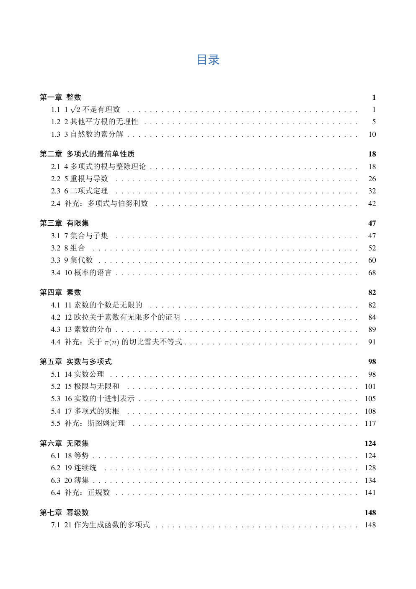
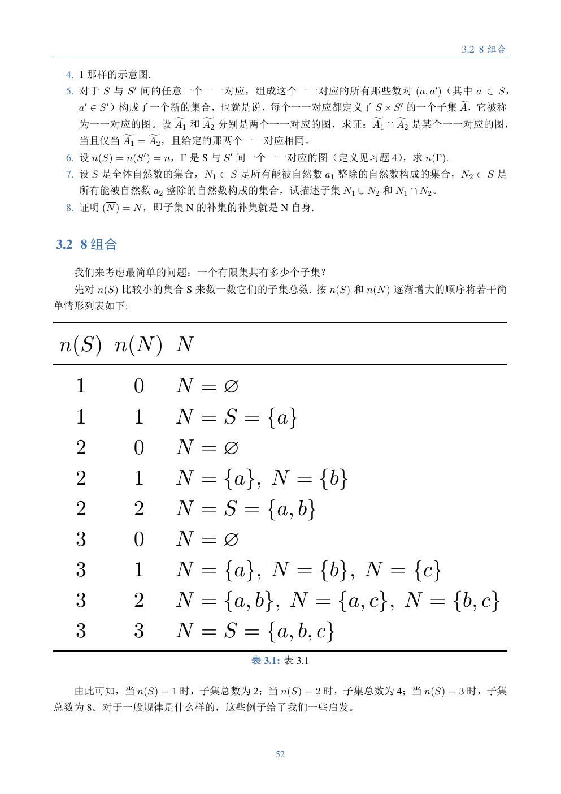
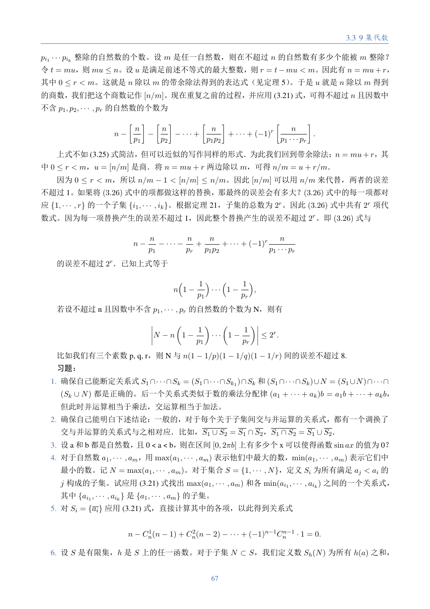
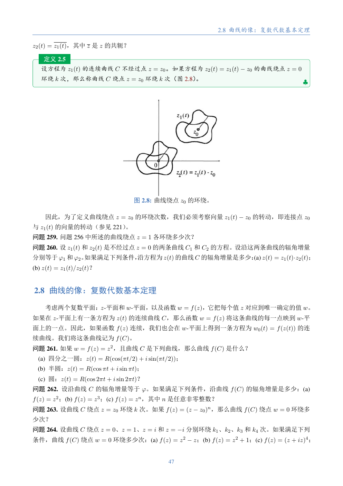

# Math Translator

将 PaddleOCR-VL 输出的数学书 Markdown 转换为 ElegantBook TeX。转换阶段保留原始语言；英文 TeX 翻译为中文是独立的可选步骤。

## 准备

需要 Python、Codex CLI、XeLaTeX，以及：

```bash
pip install requests
```

在项目根目录创建 `.env`：

```env
PADDLEOCR_TOKEN=your-token
```

以下命令均在 `tools/math-translator` 下执行。

## 1. PDF 转 OCR Markdown

本地文件：

```bash
python scripts/ppocr-vl.py "test_resources/book.pdf" \
  --output-dir output/book \
  --ocr-only
```

URL：

```bash
python scripts/ppocr-vl.py "https://example.com/book.pdf" \
  --output-dir output/book \
  --ocr-only
```

主要产物：

```text
output/book/doc_0.md
output/book/doc_1.md
output/book/imgs/
```

## 2. OCR Markdown 转 TeX

完整流程：确定正文边界、读取目录、按章节分块、转换、审校并组装。

```bash
python scripts/ocr_to_tex_agent.py \
  --output-dir output/book \
  --phase full \
  --workers 3
```

中断后直接重复同一命令即可，已有分块会跳过。只有明确需要重做已有产物时才添加 `--overwrite`。

主要产物：

```text
output/book/agent-work/page_manifest.json
output/book/agent-work/chapter_manifest.json
output/book/chapters/*.tex
output/book/book.tex
```

只重新组装根文件：

```bash
python scripts/ocr_to_tex_agent.py \
  --output-dir output/book \
  --phase assemble
```

原始 `doc_N.md` 不会被修改。

## 3. 编译 PDF

```bash
cd output/book
xelatex -interaction=nonstopmode -halt-on-error book.tex
xelatex -interaction=nonstopmode -halt-on-error book.tex
```

产物：

```text
output/book/book.pdf
```

## 4. 可选：英文 TeX 翻译为中文

仓库中的 `translator.sh` 使用 3 路并发翻译默认 `output/` 下的英文分块，并保留原始英文 TeX：

```bash
bash translator.sh
```

主要产物：

```text
output/chapters/*-zh.tex
output/book-zh.tex
output/book-zh.pdf
```

`translator.sh` 中的书名和数学领域是示例配置，处理其他书籍前按实际内容调整。

## 示例产物

完整 PDF 位于 [`test_outputs/`](test_outputs/)：

```text
test_outputs/Abel’s Theorem in Problems and Solutions.pdf
test_outputs/问题与解答中的阿贝尔定理.pdf
test_outputs/与中学生谈谈代数.pdf
```

### 目录与章节结构



### 表格映射



### 公式与习题



### 定理环境


### 插图与定义环境


